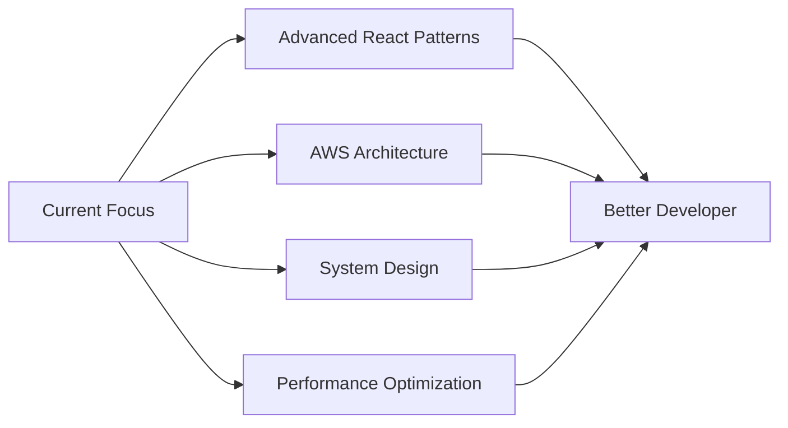

<div align="center">
  
</div>

<div align="center">
  
  []([your-linkedin-url](https://www.linkedin.com/in/theophilous-frimpong-7844b2236/))
  [](mailto:theophilusfrimpong@gmail.com)
  [](your-portfolio-url)
  
</div>

---

## 👨‍💻 About Me

> *"Building visually appealing and helpful projects that facilitate living in the 21st century."*

I'm a **Junior Software Developer** and current learner in the **ALX Prodev Program** (Frontend, Backend & AWS Cloud Computing). My journey in tech is driven by a passion for creating solutions that make everyday life easier and more beautiful.

```javascript
const developer = {
  name: "Theophilous Asante Frimpong",
  location: "Accra, Ghana",
  education: "ALX Prodev Engineer",
  focus: ["Frontend Development", "Backend Development", "Cloud Computing"],
  mission: "Becoming a better version of myself each day",
  motivation: "Solving complex, brain racking challenges",
  currentlyLearning: ["AWS", "Advanced React Patterns", "System Design"],
  lookingFor: "Junior Developer Roles & Challenging Projects"
};
```

### 🎯 What Drives Me

- 🚀 **Continuous Growth**: I believe in 1% improvement every day
- 🧩 **Complex Challenges**: I thrive on mind-boggling problems that push my limits
- 🎨 **Beautiful Solutions**: Code should be functional *and* elegant
- 🌍 **Real Impact**: Building tools that genuinely help people navigate modern life

---

## 🛠️ Tech Stack

<div align="center">

### Frontend


### Backend


### Cloud & DevOps


### Tools & Others


</div>

---

## 💼 Featured Projects

<div align="center">

### 🌟 [OG Typer](project-link)
**Commercial Product | Full-Stack Application**


A comprehensive typing practice platform with gamification, real-time multiplayer races, personalized drills, and detailed performance analytics.. Built with React, Express, and PostgreSQL.

**Tech Stack:** `React` `Express.js` `MongoDB` `AWS` `PostgresSQL`

[](demo-link) [](repo-link)

---

### 🌟 [Project Name 2](project-link)
**Mobile-Responsive Web App**


[Description of the project and its impact]. Features modern UI/UX and seamless user experience.

**Tech Stack:** `JavaScript` `React` `TailwindCSS` `Node.js`

[](demo-link) [](repo-link)

---

### 🌟 [Project Name 3](project-link)
**Cloud-Deployed Solution**


[Description focusing on the complexity and learning involved]. Deployed on AWS with CI/CD pipeline.

**Tech Stack:** `Node.js` `PostgreSQL` `AWS EC2` `AWS S3`

[](demo-link) [](repo-link)

</div>

---

## 📊 GitHub Stats

<div align="center">
  
  
</div>

<div align="center">
  
</div>

---

## 🎓 Education & Certifications

<table align="center">
  <tr>
    <td align="center" width="50%">
      
      <br/>
      <b>Frontend Development</b><br/>
      <b>Backend Development</b><br/>
      <b>AWS Cloud Computing</b>
    </td>
    <!-- <td align="center" width="50%">
      
      <br/>
      <i>Add your certifications here</i><br/>
      <i>e.g., AWS Certified, React Specialist</i>
    </td> -->
  </tr>
</table>

---

## 🌱 Currently Learning



---

## 💡 What I'm Looking For

<div align="center">

### 🎯 Junior Developer Roles

I'm actively seeking opportunities where I can:

✅ Work on **complex, challenging projects** that push my boundaries  
✅ Collaborate with **talented teams** who value growth and learning  
✅ Build **user-centric solutions** that make a real difference  
✅ Contribute to **meaningful products** in innovative companies  

</div>

---

## 📫 Let's Connect!

<div align="center">
  
I'm always open to discussing new projects, creative ideas, or opportunities to be part of your vision.

**Preferred Contact Methods:**
- 📧 Email: [theophilusfrimpong17@gmail.com](mailto:theophilusfrimpong17@gmail.com)
- 💼 LinkedIn: [Send me a message]([your-linkedin-url](https://www.linkedin.com/in/theophilous-frimpong-7844b2236/))
- 🌐 Portfolio: [View my work](your-portfolio-url)

<br/>

### 💬 *"The best way to predict the future is to create it."*


</div>

---

<div align="center">
  
  ### ⭐️ From [littlegod20](https://github.com/littlegod20)
  
  *If you find my projects interesting, feel free to star ⭐ them!*
  
</div>
